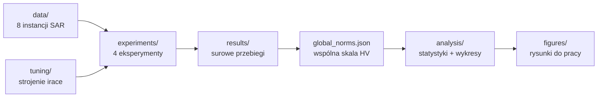

# MOEA dla planowania tras UAV w misjach poszukiwawczo-ratowniczych

Wielokryterialne algorytmy ewolucyjne (MOEA) do planowania tras zespołu bezzałogowych
statków powietrznych (UAV) w misjach poszukiwawczo-ratowniczych (SAR). Repozytorium
zawiera kompletny pipeline badawczy pracy magisterskiej: implementacje czterech
wariantów algorytmów, cztery eksperymenty, strojenie hiperparametrów (irace) oraz
analizę statystyczną z reprodukowalnymi figurami.

> Praca magisterska (PDF): [`thesis/Wasko_Adam_praca_magisterska.pdf`](thesis/Wasko_Adam_praca_magisterska.pdf)

## Problem

Zespół `k` dronów ma przeszukać obszar podzielony na regiony. Rozwiązaniem jest
przydział regionów do dronów wraz z kolejnością odwiedzania. Oceniamy je **dwoma
sprzecznymi kryteriami** (minimalizowanymi):

| Kryterium | Znaczenie |
|-----------|-----------|
| **f₁** | czas zakończenia misji — moment, w którym kończy najwolniejszy dron (makespan) |
| **f₂** | współczynnik nieodkrytych ofiar — `1 − ∫V(t)dt / (V_total · T_cut)` |

Wynikiem algorytmu jest **front Pareto** kompromisów między szybkością misji a
skutecznością pokrycia. Jakość frontu mierzymy **hiperobjętością (HV)** względem
wspólnego, globalnie znormalizowanego punktu odniesienia.

## Algorytmy — plan czynnikowy 2×2

Cztery warianty powstają z krzyżowania dwóch czynników — **architektury** pętli
ewolucyjnej i **kryterium selekcji**:

|                         | selekcja: hiperobjętość | selekcja: zatłoczenie (crowding) |
|-------------------------|-------------------------|----------------------------------|
| **stanu ustalonego (μ+1)** | `SMS-EMOA`            | `SS-NSGA-II`                     |
| **generacyjna (μ+μ)**      | `GEN-SMS-EMOA`       | `NSGA-II`                        |

Taki układ pozwala rozdzielić wpływ *architektury* od wpływu *kryterium selekcji*
za pomocą ortogonalnych kontrastów.

## Eksperymenty

1. **Inicjalizacja** (`run_initialization.py`) — populacja hybrydowa (heurystyka)
   vs. losowa.
2. **Analiza czynnikowa 2×2** (`run_factorial.py`) — architektura × selekcja na
   parametrach domyślnych.
3. **Strojenie** (`run_tuning.py` + `tuning/`) — automatyczne strojenie
   hiperparametrów pakietem **irace** i test odporności wniosków.
4. **Ablacja operatorów** (`run_ablation.py`) — zachłanna eliminacja wsteczna
   sześciu operatorów mutacji (Fawcett & Hoos), aby ustalić, które są niezbędne.

## Pipeline



## Struktura repozytorium

```
src/uav_moea/        # implementacja: algorytmy, model problemu, wejście/wyjście
  algorithm/         #   sms_emoa, nsga2, ss_nsga2, gen_sms_emoa, operatory, inicjalizacja
  model/             #   individual, objectives (f1/f2)
  io/                #   wczytywanie instancji, logowanie
main.py              # punkt wejścia CLI (pojedynczy przebieg dowolnego wariantu)
data/                # 8 instancji testowych (TC-PGI, TC-SP)
experiments/         # 4 skrypty wsadowe (jeden na eksperyment)
tuning/              # konfiguracja irace (parameters, scenario, target_runner)
analysis/            # hv_stats + skrypty rysujące figury + walidacja silnika
examples/            # skrypty demonstracyjne (inicjalizacja, przykładowy przebieg)
tests/               # testy jednostkowe (pytest)
results/             # kuratorski, mały zestaw: global_norms.json, ablation_path.json, reports/
figures/             # 5 finalnych figur z pracy (PDF + PNG)
thesis/              # praca magisterska (PDF)
```

## Instalacja

```bash
git clone <adres-repo>
cd moea-uav-sar-path-planning
python -m venv .venv && source .venv/bin/activate
pip install -e .            # rdzeń: numpy, matplotlib, scipy
pip install -e ".[dev]"     # + pytest (testy)
```

## Szybki start

Pojedynczy przebieg dowolnego wariantu na wybranej instancji:

```bash
python main.py --algo sms_emoa     --test-case data/TC-PGI/tcB.json  --eval 20000
python main.py --algo nsga2        --test-case data/TC-SP/tcGB.json  --eval 20000 --seed 42
python main.py --algo gen_sms_emoa --test-case data/TC-PGI/tcV.json  --eval 30000
```

Najważniejsze opcje: `--algo` (wariant), `--test-case` (instancja), `--eval`
(budżet ewaluacji), `--pop`, `--seed`, `--outdir`. Pełna lista: `python main.py -h`.

## Reprodukcja wyników

Figury w `figures/` są dołączone gotowe. Aby odtworzyć je od zera:

```bash
# 1. Uruchom eksperymenty (zapisują surowe przebiegi do results/*)
python experiments/run_initialization.py
python experiments/run_factorial.py
python experiments/run_tuning.py
python experiments/run_ablation.py

# 2. Wygeneruj figury (korzystają z results/global_norms.json)
python analysis/plot_illustrations.py   # rozwiązanie, front Pareto, zbieżność inicjalizacji
python analysis/plot_ablation.py        # ścieżka ablacji operatorów
```

Figura zbieżności HV czterech wariantów (`figures/convergence.pdf`) jest dołączona
gotowa. Poprawność silnika HV można sprawdzić skryptem
[`analysis/validate_engine.py`](analysis/validate_engine.py) (wymaga `pymoo`).

> **Uwaga:** surowe przebiegi eksperymentów (setki archiwów `results.json`) są
> celowo **wyłączone z repozytorium** (`.gitignore`) — potrafią zajmować gigabajty.
> Repozytorium zawiera jedynie kuratorski, mały zestaw wyników wystarczający do
> odczytania wniosków: [`results/global_norms.json`](results/global_norms.json),
> [`results/ablation/ablation_path.json`](results/ablation/ablation_path.json) oraz
> raporty tekstowe w [`results/reports/`](results/reports/).

## Wyniki

Kluczowe figury (w [`figures/`](figures/)):

| Figura | Co pokazuje |
|--------|-------------|
| `solution` | przykładowe rozwiązanie — trasy zespołu dronów |
| `pareto` | front Pareto kompromisów f₁–f₂ |
| `convergence_init` | zbieżność: inicjalizacja hybrydowa vs losowa |
| `convergence` | zbieżność HV czterech wariantów |
| `ablation_path` | ścieżka zachłannej eliminacji operatorów |

Szczegółowe raporty statystyczne (Wilcoxon, Vargha-Delaney, Holm, kontrasty
czynnikowe): [`results/reports/`](results/reports/).

## Testy

```bash
pytest
```

## Licencja

[MIT](LICENSE).
